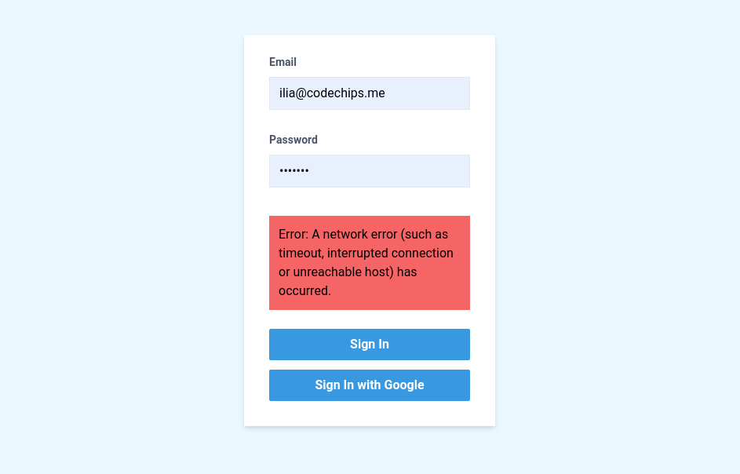

# svelte-firebase-auth-xstate-example

> :lock: How to do Firebase authentication with XState and Svelte

This is example code for my blog posts:

- [Firebase authentication with Svelte](https://codechips.me/firebase-authentication-with-svelte/)
- [Firebase authentication with Svelte and XState](https://codechips.me/firebase-authentication-with-xstate-and-svelte/).



# Firebase config

Make sure to put your Firebase API key in the `.env` file in the root directory.

```bash
VITE_FIREBASE_KEY=your-firebase-auth-key
```

Also change your project name in `App.svelte`

## How to run

Clone and run `npm i && npm run dev`

To see the complete code for the first article do:

```text
$ git checkout plain-firebase-auth
```

## There is more!

For more interesting stuff like this follow me on [Twitter](https://twitter.com/codechips) or check out my blog https://codechips.me

